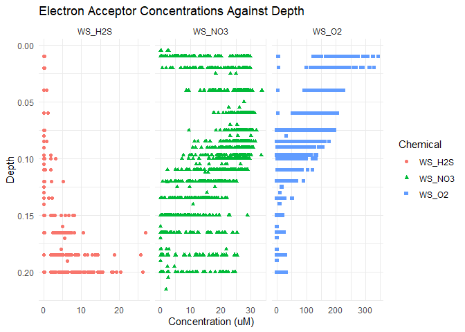
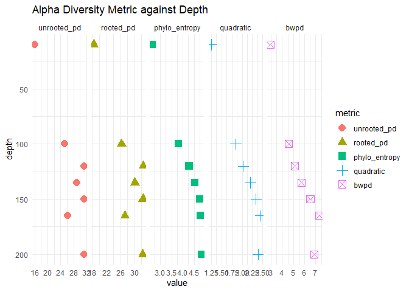
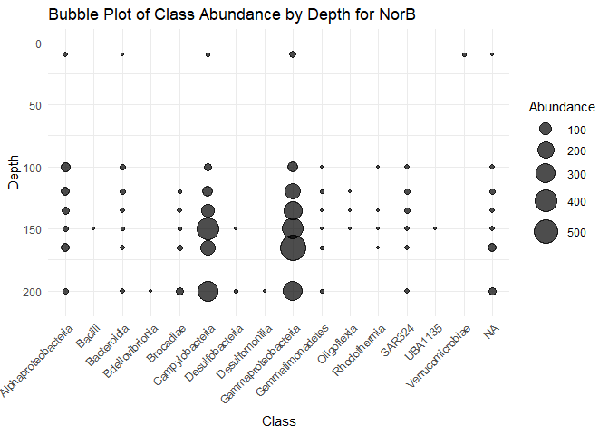

Analysis_SY
================
Shaoyu Ye
2025-03-28

## R Markdown

``` r
# Load the libraries
library(vegan)
```

    ## 载入需要的程序包：permute

    ## 载入需要的程序包：lattice

``` r
library(tidyverse)   # Includes ggplot2, dplyr, readr, etc.
```

    ## ── Attaching core tidyverse packages ──────────────────────── tidyverse 2.0.0 ──
    ## ✔ dplyr     1.1.4     ✔ readr     2.1.5
    ## ✔ forcats   1.0.0     ✔ stringr   1.5.1
    ## ✔ ggplot2   3.5.1     ✔ tibble    3.2.1
    ## ✔ lubridate 1.9.4     ✔ tidyr     1.3.1
    ## ✔ purrr     1.0.4

    ## ── Conflicts ────────────────────────────────────────── tidyverse_conflicts() ──
    ## ✖ dplyr::filter() masks stats::filter()
    ## ✖ dplyr::lag()    masks stats::lag()
    ## ℹ Use the conflicted package (<http://conflicted.r-lib.org/>) to force all conflicts to become errors

``` r
library(pheatmap)

# Load the data from the CSV file
saanich_data <- read_csv("../Saanich_Data.csv")  # Change this to read_tsv() if needed
```

    ## Rows: 1605 Columns: 29
    ## ── Column specification ────────────────────────────────────────────────────────
    ## Delimiter: ","
    ## dbl  (28): Longitude, Latitude, Cruise, Depth, WS_O2, PO4, SI, WS_NO3, Mean_...
    ## date  (1): Date
    ## 
    ## ℹ Use `spec()` to retrieve the full column specification for this data.
    ## ℹ Specify the column types or set `show_col_types = FALSE` to quiet this message.

``` r
# Display the first few rows of the dataset
head(saanich_data)
```

    ## # A tibble: 6 × 29
    ##   Longitude Latitude Cruise Date       Depth WS_O2   PO4    SI WS_NO3 Mean_NH4
    ##       <dbl>    <dbl>  <dbl> <date>     <dbl> <dbl> <dbl> <dbl>  <dbl>    <dbl>
    ## 1     -124.     48.6      1 2006-02-18 0.01     NA  2.42    NA   26.7       NA
    ## 2     -124.     48.6      1 2006-02-18 0.025    NA  2.11    NA   23.2       NA
    ## 3     -124.     48.6      1 2006-02-18 0.04     NA  2.14    NA   19.5       NA
    ## 4     -124.     48.6      1 2006-02-18 0.055    NA  2.49    NA   22.6       NA
    ## 5     -124.     48.6      1 2006-02-18 0.07     NA  2.24    NA   23.1       NA
    ## 6     -124.     48.6      1 2006-02-18 0.08     NA  2.80    NA   23.1       NA
    ## # ℹ 19 more variables: Std_NH4 <dbl>, Mean_NO2 <dbl>, Std_NO2 <dbl>,
    ## #   WS_H2S <dbl>, Std_H2S <dbl>, Cells.ml <dbl>, Mean_N2 <dbl>, Std_n2 <dbl>,
    ## #   Mean_O2 <dbl>, Std_o2 <dbl>, Mean_co2 <dbl>, Std_co2 <dbl>, Mean_N2O <dbl>,
    ## #   Std_N2O <dbl>, Mean_CH4 <dbl>, Std_CH4 <dbl>, Temperature <dbl>,
    ## #   Salinity <dbl>, Density <dbl>

``` r
# Histogram
ggplot(saanich_data, aes(x = WS_O2)) +
  geom_histogram(bins = 10, fill = "gray", colour = "black") +
  labs(title = "Distribution of Oxygen Concentrations",
       x = "O2 (uM)",
       y = "Frequency") +
  theme_minimal()
```

    ## Warning: Removed 356 rows containing non-finite outside the scale range
    ## (`stat_bin()`).

<!-- -->

``` r
# Scatterplot
ggplot(saanich_data, aes(x = WS_O2, y = WS_NO3, color = Depth)) +
  geom_point() +
  labs(title = "Oxygen vs Nitrate Concentrations by Depth",
       x = "O2 (uM)",
       y = "NO3 (uM)") +
  scale_color_gradient(low = "black", high = "lightgray", trans = "reverse") +  # Grayscale gradient
  theme_minimal()
```

    ## Warning: Removed 487 rows containing missing values or values outside the scale range
    ## (`geom_point()`).

<!-- -->

``` r
# Vertical plot
# Select relevant columns
saanich_data_wide <- saanich_data %>%
  select(Cruise, Date, Depth, WS_O2, WS_NO3, WS_H2S)

# Pivot data to a longer format for faceting
saanich_data_longer <- saanich_data_wide %>%
  pivot_longer(cols = starts_with("WS_"),
               names_to = "Chemical",
               values_to = "Concentration_uM")

ggplot(saanich_data_longer, aes(y = Depth, x = Concentration_uM)) +
  geom_point(aes(colour = Chemical, shape = Chemical)) +
  scale_y_reverse() +
  labs(title = "Electron Acceptor Concentrations Against Depth",
       x = "Concentration (uM)") +
  theme_minimal() +
  facet_grid(. ~ Chemical, scales = "free_x")
```

    ## Warning: Removed 681 rows containing missing values or values outside the scale range
    ## (`geom_point()`).

<!-- -->

``` r
## Saanich TreeSAPP DsrAB
# Load the data from the CSV file
alpha_data <- read_csv("../alpha_diversity/SI_TS_DsrAB_alpha_diversiy.csv")  # Change this to read_tsv() if needed
```

    ## Rows: 7 Columns: 6
    ## ── Column specification ────────────────────────────────────────────────────────
    ## Delimiter: ","
    ## chr (1): placerun
    ## dbl (5): phylo_entropy, quadratic, unrooted_pd, rooted_pd, bwpd
    ## 
    ## ℹ Use `spec()` to retrieve the full column specification for this data.
    ## ℹ Specify the column types or set `show_col_types = FALSE` to quiet this message.

``` r
# Split the placerun column
alpha_data <- alpha_data %>%
  separate(placerun, into = c("sample", "depth", "gene", "extra"), sep = "_", remove = FALSE) %>%
  select(-extra) %>%  # Remove the 'extra' column
  mutate(depth = as.numeric(gsub("m", "", depth)))  # Remove 'm' and convert to numeric
```

    ## Warning: Expected 4 pieces. Additional pieces discarded in 7 rows [1, 2, 3, 4,
    ## 5, 6, 7].

``` r
# Display the first few rows of the dataset
head(alpha_data)
```

    ## # A tibble: 6 × 9
    ##   placerun      sample depth gene  phylo_entropy quadratic unrooted_pd rooted_pd
    ##   <chr>         <chr>  <dbl> <chr>         <dbl>     <dbl>       <dbl>     <dbl>
    ## 1 SI072_100m_D… SI072    100 DsrAB          3.09      1.66       13.4      14.5 
    ## 2 SI072_10m_Ds… SI072     10 DsrAB          2.54      1.48        8.80      9.91
    ## 3 SI072_120m_D… SI072    120 DsrAB          3.10      1.60       14.2      15.4 
    ## 4 SI072_135m_D… SI072    135 DsrAB          3.20      1.66       14.9      16.0 
    ## 5 SI072_150m_D… SI072    150 DsrAB          3.24      1.65       15.6      16.3 
    ## 6 SI072_165m_D… SI072    165 DsrAB          3.26      1.69       13.9      14.6 
    ## # ℹ 1 more variable: bwpd <dbl>

``` r
# Load the data from the CSV file
beta_data <- read_csv("../beta_diversity/SI_TS_DsrAB_beta_diversity.csv")  # Change this to read_tsv() if needed
```

    ## Rows: 21 Columns: 3
    ## ── Column specification ────────────────────────────────────────────────────────
    ## Delimiter: ","
    ## chr (2): sample_1, sample_2
    ## dbl (1): Z_1
    ## 
    ## ℹ Use `spec()` to retrieve the full column specification for this data.
    ## ℹ Specify the column types or set `show_col_types = FALSE` to quiet this message.

``` r
# Display the first few rows of the dataset
head(beta_data)
```

    ## # A tibble: 6 × 3
    ##   sample_1                          sample_2                            Z_1
    ##   <chr>                             <chr>                             <dbl>
    ## 1 SI072_100m_DsrAB_complete_profile SI072_10m_DsrAB_complete_profile  0.887
    ## 2 SI072_100m_DsrAB_complete_profile SI072_120m_DsrAB_complete_profile 0.409
    ## 3 SI072_100m_DsrAB_complete_profile SI072_135m_DsrAB_complete_profile 0.384
    ## 4 SI072_100m_DsrAB_complete_profile SI072_150m_DsrAB_complete_profile 0.835
    ## 5 SI072_100m_DsrAB_complete_profile SI072_165m_DsrAB_complete_profile 0.989
    ## 6 SI072_100m_DsrAB_complete_profile SI072_200m_DsrAB_complete_profile 1.25

# Alpha Diversity

This plot shows all the alpha diversity metrics for DrsAB across the 7
depths of cruise 72. What does this tell us based on the definition of
these metrics? (see Project_TreeSAPP_DsrAB_diversity for definitions)

``` r
# Select relevant columns
alpha_data_wide <- alpha_data %>%
  select(depth, phylo_entropy, quadratic, unrooted_pd, rooted_pd, bwpd)

# Pivot data to a longer format for faceting
alpha_data_longer <- alpha_data_wide %>%
  pivot_longer(cols = c("phylo_entropy", "quadratic", "unrooted_pd", "rooted_pd", "bwpd"),
               names_to = "metric",
               values_to = "value")

# Define your desired order of metrics
desired_order <- c("unrooted_pd", "rooted_pd", "phylo_entropy", "quadratic", "bwpd")

# Convert 'metric' column to a factor with specified levels
alpha_data_longer$metric <- factor(alpha_data_longer$metric, levels = desired_order)

ggplot(alpha_data_longer, aes(y = depth, x = value)) +
  geom_point(aes(colour = metric, shape = metric), size = 4) +
  scale_y_reverse() +
  labs(title = "Alpha Diversity Metric against Depth",
       x = "value") +
  theme_minimal() +
  facet_grid(. ~ metric, scales = "free_x")
```

<!-- -->

\#Beta Diversity Now we can look at samples compared to eachother using
KR distance. But first the data needs some cleaning.

``` r
# Split 'sample_1' and 'sample_2' into their components (optional but useful for clarity)
beta_data <- beta_data %>%
  mutate(
    sample_1 = gsub("_DsrAB_complete_profile", "", sample_1),
    sample_2 = gsub("_DsrAB_complete_profile", "", sample_2)
  ) %>%
  mutate(
    sample_1 = gsub("SI072_", "", sample_1),
    sample_2 = gsub("SI072_", "", sample_2)
  ) %>%
  mutate(
    sample_1 = as.numeric(gsub("m", "", sample_1)),
    sample_2 = as.numeric(gsub("m", "", sample_2))
  )

# Generate a list of all unique samples from both columns
all_samples <- sort(unique(c(beta_data$sample_1, beta_data$sample_2)))

# Create an empty matrix filled with NA
beta_matrix_complete <- matrix(NA,
                               nrow = length(all_samples),
                               ncol = length(all_samples),
                               dimnames = list(all_samples, all_samples))

# Fill in the matrix symmetrically
for (i in seq_len(nrow(beta_data))) {
  row_name <- as.character(beta_data$sample_1[i])
  col_name <- as.character(beta_data$sample_2[i])
  value <- beta_data$Z_1[i]
  
  # Assign value to both [row, col] and [col, row] to make it symmetrical
  beta_matrix_complete[row_name, col_name] <- value
  beta_matrix_complete[col_name, row_name] <- value
}

# Replace NA with 0 if desired (or leave as NA for missing values)
beta_matrix_complete[is.na(beta_matrix_complete)] <- 0

# Convert to a data frame for compatibility with pheatmap
beta_matrix_clean <- as.data.frame(beta_matrix_complete)

# View the completed matrix
print(beta_matrix_clean)
```

    ##           10      100      120      135      150      165      200
    ## 10  0.000000 0.887415 0.823000 0.859674 1.134750 1.379350 1.257030
    ## 100 0.887415 0.000000 0.408684 0.383812 0.835392 0.989408 1.245400
    ## 120 0.823000 0.408684 0.000000 0.377560 0.575683 0.789348 1.022770
    ## 135 0.859674 0.383812 0.377560 0.000000 0.791192 0.931251 0.942531
    ## 150 1.134750 0.835392 0.575683 0.791192 0.000000 0.572299 1.246880
    ## 165 1.379350 0.989408 0.789348 0.931251 0.572299 0.000000 1.140560
    ## 200 1.257030 1.245400 1.022770 0.942531 1.246880 1.140560 0.000000

Now the plotting:

``` r
# Sort rows by their names or a specific column
sorted_matrix <- beta_matrix_clean[order(rownames(beta_matrix_clean)), , drop = FALSE]

# Cluster columns
col_clust <- hclust(dist(t(sorted_matrix)))  # Create column dendrogram
# Flip dendrogram branches if desired
col_clust$order <- order(rownames(beta_matrix_clean))

# Plot the heatmap
pheatmap(as.matrix(sorted_matrix),
         cluster_rows = FALSE,
         cluster_cols = col_clust,
         scale = "none",
         color = colorRampPalette(c("black", "gray", "white"))(100),
         border_color = NA,
         main = "KR Distance Heatmap with Dendrogram")
```

<!-- -->

# Bubble Plots

We have a good picture of the overall diversity for DsrAB across the
samples. Let’s explore the taxonomy of a sample and associate that with
the abundance of DrsAB orthologs.

In order to look at all the samples together we need to contatenate the
TreeSAPP classifications.tsv from each depth. Be sure to carefully
replace the below paths for the files with the paths to the files you’d
like to combine.

Load Data

``` r
# List of classification files
file_list <- c("../classifications/classifications_10m.tsv",
               "../classifications/classifications_100m.tsv",
               "../classifications/classifications_120m.tsv",
               "../classifications/classifications_135m.tsv",
               "../classifications/classifications_150m.tsv",
               "../classifications/classifications_165m.tsv",
               "../classifications/classifications_200m.tsv"
               )
# Merge all data frames by row names (assuming all files have a common columns)
class_data <- file_list %>%
    lapply(read_tsv, col_types = cols(.default = "c")) %>%
    bind_rows()
# Split the Sample column
class_data <- class_data %>%
  separate(Sample, into = c("Sample", "Depth", "extra"), sep = "_", remove = FALSE) %>%
  select(-extra) %>%  # Remove the 'extra' column
  mutate(Depth = as.numeric(gsub("m", "", Depth))) %>% # Remove 'm' and convert to numeric
  separate(Taxonomy, into = c("Root", "Domain", "Phylum", "Class", "Order", "Family", "Genus", "Species"), sep = ";", fill = "right") %>%
  select(-Root)  # Remove the 'Root' column
sub_data <- class_data %>%
  filter(Marker == "DsrAB")
sub_data %>% filter(is.na(as.numeric(Abundance)))
```

    ## # A tibble: 0 × 19
    ## # ℹ 19 variables: Sample <chr>, Depth <dbl>, Query <chr>, Marker <chr>,
    ## #   Start_pos <chr>, End_pos <chr>, Domain <chr>, Phylum <chr>, Class <chr>,
    ## #   Order <chr>, Family <chr>, Genus <chr>, Species <chr>, Abundance <chr>,
    ## #   iNode <chr>, E-value <chr>, LWR <chr>, EvoDist <chr>, Distances <chr>

``` r
# Display the first few rows of the dataset
head(sub_data)
```

    ## # A tibble: 6 × 19
    ##   Sample Depth Query   Marker Start_pos End_pos Domain Phylum Class Order Family
    ##   <chr>  <dbl> <chr>   <chr>  <chr>     <chr>   <chr>  <chr>  <chr> <chr> <chr> 
    ## 1 SI072     10 k147_3… DsrAB  5         251     " d__… " p__… " c_… " o_… " f__…
    ## 2 SI072     10 k147_2… DsrAB  1         141     " d__… " p__… " c_… " o_… " f__…
    ## 3 SI072     10 k147_3… DsrAB  2         96       <NA>   <NA>   <NA>  <NA>  <NA> 
    ## 4 SI072     10 k147_4… DsrAB  505       768      <NA>   <NA>   <NA>  <NA>  <NA> 
    ## 5 SI072     10 k147_3… DsrAB  1         256     " d__… " p__… " c_… " o_… " f__…
    ## 6 SI072     10 k147_3… DsrAB  2         105      <NA>   <NA>   <NA>  <NA>  <NA> 
    ## # ℹ 8 more variables: Genus <chr>, Species <chr>, Abundance <chr>, iNode <chr>,
    ## #   `E-value` <chr>, LWR <chr>, EvoDist <chr>, Distances <chr>

# Bubbleplot for DsrAB

``` r
# Sum Abundance by Sample, Phylum, and Depth
data_taxa <- sub_data %>%
  mutate(Abundance = as.numeric(Abundance)) %>%  
  group_by(Sample, Class, Depth) %>%
  summarise(Abundance = sum(Abundance, na.rm = TRUE), .groups = "drop") %>%
  mutate(Class = gsub("c__", "", Class))

ggplot(data_taxa, aes(x = Class, y = Depth)) +
  geom_point(aes(size = Abundance), color = "black", alpha = 0.7) +  # Fixed black color
  scale_y_reverse(limits = c(210, 0)) +  # Shallow at top, deep at bottom
  scale_size(range = c(1, 10)) +
  theme_minimal() +
  labs(title = "Bubble Plot of Class Abundance by Depth for DsrAB",
       x = "Class",
       y = "Depth",
       size = "Abundance") +
  theme(axis.text.x = element_text(angle = 45, hjust = 1))
```

<!-- -->
