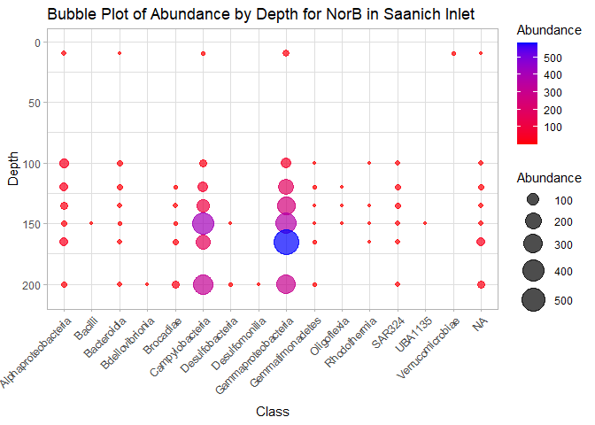
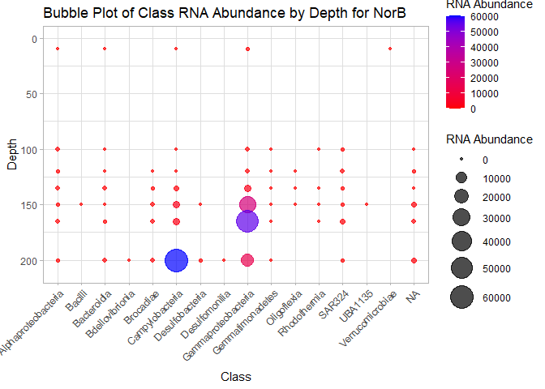

DNA+RNA_BubblePlot.R
================
Raychal Ng
2025-04-02

``` r
library(tidyverse)
```

    ## ── Attaching core tidyverse packages ──────────────────────── tidyverse 2.0.0 ──
    ## ✔ dplyr     1.1.4     ✔ readr     2.1.5
    ## ✔ forcats   1.0.0     ✔ stringr   1.5.1
    ## ✔ ggplot2   3.5.1     ✔ tibble    3.2.1
    ## ✔ lubridate 1.9.4     ✔ tidyr     1.3.1
    ## ✔ purrr     1.0.4     
    ## ── Conflicts ────────────────────────────────────────── tidyverse_conflicts() ──
    ## ✖ dplyr::filter() masks stats::filter()
    ## ✖ dplyr::lag()    masks stats::lag()
    ## ℹ Use the conflicted package (<http://conflicted.r-lib.org/>) to force all conflicts to become errors

``` r
library(dplyr)


# resolved to CLASS

## DNA
# load all DNA classifications from the different depths
ten <- read.delim("classifications/classifications10.tsv", sep = '\t', header = TRUE) 
onehundred <- read.delim("classifications/classifications100.tsv", sep = '\t', header = TRUE)
onetwenty <- read.delim("classifications/classifications120.tsv", sep = '\t', header = TRUE)
onethirtyfive <- read.delim("classifications/classifications135.tsv", sep = '\t', header = TRUE)
onefifty <- read.delim("classifications/classifications150.tsv", sep = '\t', header = TRUE)
onesixtyfive <- read.delim("classifications/classifications165.tsv", sep = '\t', header = TRUE)
twohundred <- read.delim("classifications/classifications200.tsv", sep = '\t', header = TRUE)

# merge classification.tsv from all depths 
merged_data <- rbind(ten, onehundred, onetwenty, onethirtyfive, onefifty, onesixtyfive, twohundred)

# Split the Sample column
merged_data <- merged_data %>%
  separate(Sample, into = c("Sample", "Depth", "extra"), sep = "_", remove = FALSE) %>%
  select(-extra) %>%  # Remove the 'extra' column
  mutate(Depth = as.numeric(gsub("m", "", Depth))) %>% # Remove 'm' and convert to numeric
  separate(Taxonomy, into = c("Root", "Domain", "Phylum", "Class", "Order", "Family", "Genus", "Species"), sep = ";", fill = "right") %>%
  select(-Root)  # Remove the 'Root' column

NorB_data <- merged_data %>%
  filter(Marker == "NorB")

# Sum Abundance by Sample, Phylum, and Depth
data_taxa <- NorB_data %>%
  group_by(Sample, Class, Depth) %>%
  summarise(Abundance = sum(Abundance, na.rm = TRUE), .groups = "drop") %>%
  mutate(Class = gsub("c__", "", Class))

# Make Bubble Plot
ggplot(data_taxa, aes(x = Class, y = Depth)) +
  geom_point(aes(size = Abundance, color = Abundance), alpha = 0.7) +  # Map color to Abundance
  scale_y_reverse(limits = c(210, 0)) +  # Shallow at top, deep at bottom
  scale_color_gradient(low = "red", high = "blue") +  # Gradient from red (low) to blue (high)
  scale_size(range = c(1, 10)) +
  theme_light() +
  labs(title = "Bubble Plot of Abundance by Depth for NorB in Saanich Inlet",
       x = "Class",
       y = "Depth",
       size = "Abundance") +
  theme(axis.text.x = element_text(angle = 45, hjust = 1))
```

<!-- -->

``` r
# save plot
ggsave("NorB_BubblePlot.jpg")
```

    ## Saving 7 x 5 in image

``` r
sum(is.na(NorB_data$Class))
```

    ## [1] 65

``` r
sum(is.na(NorB_data$Genus))
```

    ## [1] 203

``` r
sum(is.na(NorB_data$Species))
```

    ## [1] 558

``` r
#Metatranscriptomics/RNA

# load all DNA classifications from the different depths
tenRNA <- read.delim("classifications/classifications10RNA.tsv", sep = '\t', header = TRUE) 
onehundredRNA <- read.delim("classifications/classifications100RNA.tsv", sep = '\t', header = TRUE)
onetwentyRNA <- read.delim("classifications/classifications120RNA.tsv", sep = '\t', header = TRUE)
onethirtyfiveRNA <- read.delim("classifications/classifications135RNA.tsv", sep = '\t', header = TRUE)
onefiftyRNA <- read.delim("classifications/classifications150RNA.tsv", sep = '\t', header = TRUE)
onesixtyfiveRNA <- read.delim("classifications/classifications165RNA.tsv", sep = '\t', header = TRUE)
twohundredRNA <- read.delim("classifications/classifications200RNA.tsv", sep = '\t', header = TRUE)


# merge classification.tsv from all depths 
merged_dataRNA <- rbind(tenRNA, onehundredRNA, onetwentyRNA, onethirtyfiveRNA, onefiftyRNA, onesixtyfiveRNA, twohundredRNA)

# Split the Sample column
merged_dataRNA <- merged_dataRNA %>%
  separate(Sample, into = c("Sample", "Depth", "extra"), sep = "_", remove = FALSE) %>%
  select(-extra) %>%  # Remove the 'extra' column
  mutate(Depth = as.numeric(gsub("m", "", Depth))) %>% # Remove 'm' and convert to numeric
  separate(Taxonomy, into = c("Root", "Domain", "Phylum", "Class", "Order", "Family", "Genus", "Species"), sep = ";", fill = "right") %>%
  select(-Root)  # Remove the 'Root' column
```

    ## Warning: Expected 3 pieces. Additional pieces discarded in 19051 rows [1, 2, 3, 4, 5, 6,
    ## 7, 8, 9, 10, 11, 12, 13, 14, 15, 16, 17, 18, 19, 20, ...].

``` r
NorB_RNAdata <- merged_dataRNA %>%
  filter(Marker == "NorB")

# Sum Abundance by Sample, Phylum, and Depth
RNAdata_taxa <- NorB_RNAdata %>%
  group_by(Sample, Class, Depth) %>%
  summarise(Abundance = sum(Abundance, na.rm = TRUE), .groups = "drop") %>%
  mutate(Class = gsub("c__", "", Class))

# Make Bubble Plot
ggplot(RNAdata_taxa, aes(x = Class, y = Depth)) +
  geom_point(aes(size = Abundance, color = Abundance), alpha = 0.7) +  # Map color to Abundance
  scale_y_reverse(limits = c(210, 0)) +  # Shallow at top, deep at bottom
  scale_color_gradient(low = "red", high = "blue") +  # Gradient from red (low) to blue (high)
  scale_size(range = c(1, 10)) +
  theme_light() +
  labs(title = "Bubble Plot of Class RNA Abundance by Depth for NorB",
       x = "Class",
       y = "Depth",
       size = "RNA Abundance",
       color = "RNA Abundance") +  # Label for color legend
  theme(axis.text.x = element_text(angle = 45, hjust = 1))
```

<!-- -->

``` r
ggsave("NorB_BubblePlotRNA.jpg")
```

    ## Saving 7 x 5 in image

\`\`\`
